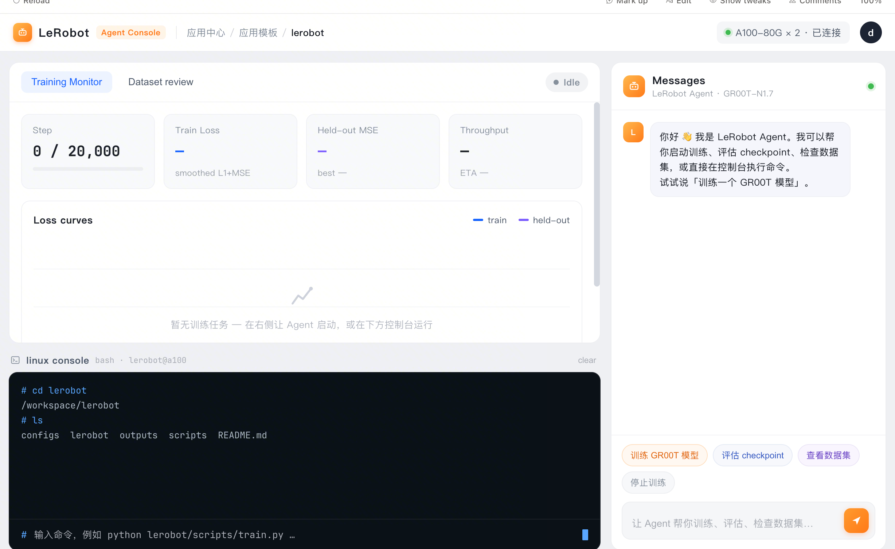

# LeRobot Agent Console

A single-page, white-background web console to operate **LeRobot** — a Linux
shell and an AI chat agent side by side, in the browser. It is a standalone app
that **uses** LeRobot (it is not part of the LeRobot source tree); it ships in
the same container as a LeRobot image so the shell and the agent act on the same
checkout.



## What you get

- **Linux console** (left/bottom) — a real PTY into the container. Exactly what
  you'd get from `kubectl exec`, but in the browser. Run any LeRobot command:
  `lerobot-train`, `lerobot-eval`, `lerobot-record`, …
- **Chat** (right) — the [`hermes`](https://hermes.nousresearch.com) agent. Ask
  it to plan an SFT run, evaluate a checkpoint, inspect a dataset, etc. It can
  run safe commands itself; dangerous commands require approval (no `--yolo`).
- **Training monitor** (top-left) — a placeholder panel matching the reference
  layout (wire it to your own metrics source as needed).

## Chat needs a Volcengine (Ark) API key

The agent talks to **Volcengine Ark** (火山方舟). The **first time** you open
chat, a modal asks for your Ark API key. It is written to the hermes config and
**only affects chat** — the terminal and everything else are untouched. Re-enter
it any time via the ⚙ button in the chat header.

Endpoint defaults to `https://ark.cn-beijing.volces.com/api/v3`, model
`doubao-seed-2-0-pro-260215` (both overridable in the modal's *Advanced* section
or via `ARK_BASE_URL` / `ARK_MODEL`).

## Run locally (dev)

```bash
pip install -r requirements.txt        # aiohttp
hermes --version                       # the agent must be on PATH for chat
python server.py                        # serves http://0.0.0.0:8080
```

Environment knobs:

| var | default | meaning |
|---|---|---|
| `PORT` | `8080` | HTTP port |
| `CONSOLE_WORKDIR` | cwd | shell + agent working directory |
| `CONSOLE_SHELL` | `bash` | shell for the PTY console |
| `HERMES_BIN` | `hermes` | hermes executable |
| `HERMES_CHAT_SKILL` | `robot_sft` | skill preloaded into chat (empty to disable) |
| `HERMES_HOME` | `~/.hermes` | hermes config + session store location |
| `ARK_BASE_URL` / `ARK_MODEL` | Ark Beijing / doubao | chat provider defaults |

## The robot_sft skill (requirement f)

Chat preloads the [`robot_sft`](https://github.com/thesues/robot_sft) skill so
the agent knows the LeRobot SFT pipeline. Install it into hermes with:

```bash
./scripts/install_skill.sh           # hermes skills install thesues/robot_sft
```

The Dockerfile installs it at build time, and the entrypoint re-installs it at
runtime if it is missing.

## Build & deploy on VKE

The image layers this console on top of a LeRobot image, so one container has
both the console (`:8080`) and the full LeRobot environment.

```bash
# Build ON TOP of your LeRobot image. Push with GZIP — VKE node containerd 1.6.x
# rejects zstd layers (`number of layers and diffIDs don't match`).
docker buildx build \
  --build-arg BASE_IMAGE=iaas-us-cn-beijing.cr.volces.com/physicalai/lerobot:<tag> \
  --output type=image,name=<registry>/lerobot-console:<tag>,push=true,compression=gzip,force-compression=true,oci-mediatypes=true \
  .

# Deploy
kubectl apply -f k8s/deployment.yaml
kubectl apply -f k8s/service.yaml

# Open it (public inbound is blocked on iaas-test03 — use port-forward)
kubectl port-forward svc/lerobot-console 8080:8080
open http://localhost:8080

# You can still exec into the pod and run anything directly:
kubectl exec -it deploy/lerobot-console -- bash
```

> **zstd ↔ VKE note:** the VKE node here runs containerd 1.6.38, whose zstd
> support is incomplete. Always push this image gzip-compressed. zstd is only
> safe on nodes with containerd ≥ 1.7.

## Endpoints

| route | purpose |
|---|---|
| `GET /` | the single-page UI |
| `GET /api/status` | `{chat_ready, model, base_url, skill, workdir}` |
| `POST /api/volcano-key` | set the Ark api key for chat (`{api_key, base_url?, model?}`) |
| `WS /ws/term` | PTY shell bridge |
| `WS /ws/chat` | one hermes turn per message, with session continuity |

## License

MIT
